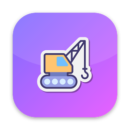
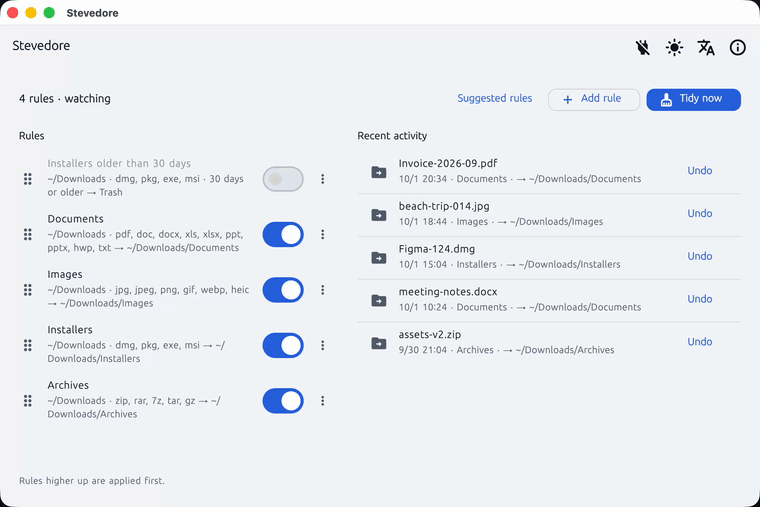
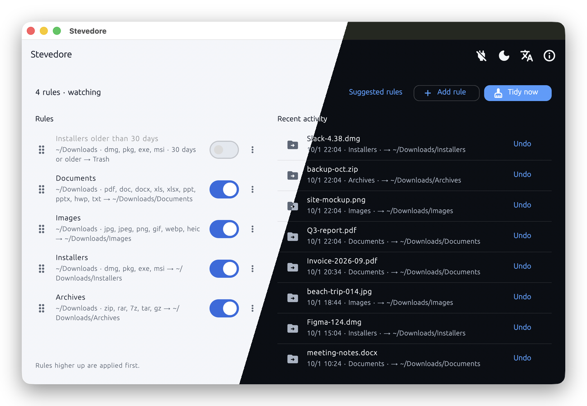

<!-- From jejezz/application-release-templates common/tool/readme @ conventions-v1.
     Generated by tool/readme/init_readme.py — see conventions/readme-guide.md.
     Fill every {{TODO: …}}; tool/readme/check_readme.py fails while any is left. -->

<p align="center">
  
</p>

<h1 align="center">Stevedore</h1>

<p align="center">
  A free, open-source <b>Hazel alternative for macOS and Windows</b> — a tray app that sorts your Downloads folder by rules, automatically or on demand.
</p>

<p align="center">
  <a href="https://github.com/jejezz/stevedore-flutter/releases/latest"></a>
  <a href="https://github.com/jejezz/stevedore-flutter/releases"></a>
  
  
  <a href="LICENSE"></a>
</p>

<p align="center">
  <b>English</b> · <a href="README.ko.md">한국어</a>
</p>

<p align="center">
  
</p>

## Features

- **Rules by extension, name, size and age** — conditions are ANDed (e.g. `dmg, pkg` older than 30 days); the action is *move to a folder* or *move to Trash*. Rules higher in the list win, and a rule with no condition never matches anything.
- **Sorts Downloads as files arrive** — watches the folder in the background and waits until a file's size and modified time have been stable for 5 seconds, so `.crdownload`, `.download`, `.part` and other in-progress files are never touched.
- **Preview first, undo later** — *Tidy now* shows exactly what would move where before anything happens. Every move is logged under Recent activity with an **Undo** that puts the file back with its original name.
- **Never overwrites, never deletes** — a name clash becomes `report (1).pdf`; "delete" means the Trash (Finder's *Put Back* works on macOS).
- **Suggested rules** — start with ready-made Documents, Images, Installers and Archives rules (with a live count of the files each would catch), then edit them in the rule editor.
- **Lives in the tray / menu bar** — closing the window keeps it running; optional launch at login starts it hidden.
- **Light & dark, English & 한국어** — follows the system, or pick one in the toolbar

<p align="center">
  
  
</p>

## Install

Download from [**Releases**](https://github.com/jejezz/stevedore-flutter/releases/latest):

| OS | File |
|---|---|
| macOS 12.0+ | `Stevedore-<version>-macos-universal.dmg` — open it and drag Stevedore to Applications |
| Windows 10/11 (x64) | `Stevedore-<version>-windows-x64-setup.exe` |

**macOS:** the first time Stevedore looks at your Downloads folder, macOS asks whether to allow it — choose **Allow** (rules can't run without it).

**Windows:** the installer isn't code-signed yet, so SmartScreen says "Windows protected your PC" — choose **More info → Run anyway**.

## How it works

Dart does the work: `Directory.watch()` (FSEvents on macOS, `ReadDirectoryChangesW` on Windows) wakes it only when a watched folder changes. The engine is split into a side-effect-free `plan` and an `apply` that re-checks each file before touching it, so the same code drives the preview, the live watcher and the tests. A small Swift bridge calls `FileManager.trashItem`, which is what makes Undo from the Trash possible on macOS; on Windows the Recycle Bin is reached through PowerShell, so Trash moves can't be undone from inside the app yet.

## Development

```bash
flutter pub get
flutter run -d macos
```

No extra tools are needed. The macOS app is deliberately **not sandboxed** — it has to read Downloads and move files into arbitrary folders — so it ships as a notarized DMG rather than through the App Store. Settings live in `~/Library/Application Support/Stevedore` (`%APPDATA%\Stevedore` on Windows): `rules.json` and `history.json`.

Releasing: `scripts/bump-version.sh patch`, merge, then tag `vX.Y.Z` — CI builds and publishes every platform. Rules: [application-release-templates/conventions](https://github.com/jejezz/application-release-templates/tree/main/conventions).

## Credits

- Font: [SeoulNamsan](https://www.seoul.go.kr/seoul/font.do) (Seoul Metropolitan Government)
- Icons: [Icons8](https://icons8.com)

## License

[MIT](LICENSE) © 2026 Jongyun Ahn
